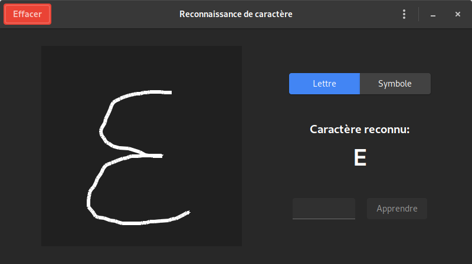

# Reconnaissance de caractères

## Présentation

Un utilitaire de reconnaissance de caractère pour le projet de POO2 réalisé en Python 3 en utilisant la bibliothèque PyGTK



## Auteurs

* François Grabenstaetter
* Danyl El-Kabir

## Utilisation

Le programme essaie de reconnaître la lettre ou le symbole (activer le bon bouton) désinné dans la zone de gauche. Si le caractère reconnu n'est pas le bon, il est possible de corriger celà en faisant ré-apprendre au programme le bon caractère.

Il est possible de remettre les données d'apprentissage par défaut depuis le menu.

**Caractères possibles:**
* **Lettres:** A, B, C, D, E, F, G, H, I, J, K, L, M, N, O, P, Q, R, S, T, U, V, W, X, Y, Z
* **Symboles (chiffres et spéciaux):** 0, 1, 2, 3, 4, 5, 6, 7, 8, 9, SPACE, RETURN, SHIFT, CAPS LOCK, BACK-SPACE

## Lancer le programme

```bash
chmod +x run.py
./run.py
```
